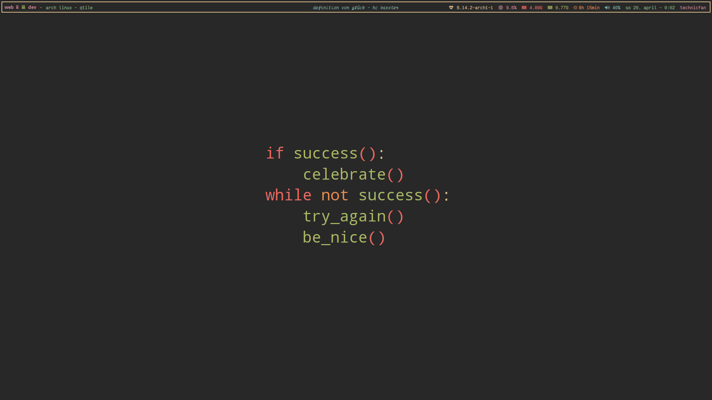
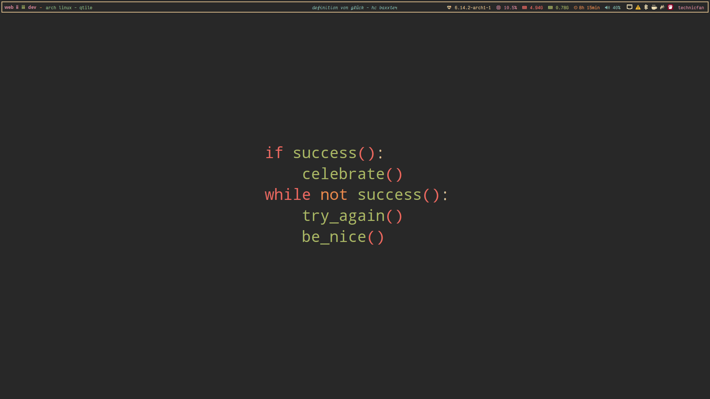

# my-qtile

personal qtile config originally based on DT's config (https://gitlab.com/dwt1/dotfiles/-/tree/master/.config/qtile?ref_type=heads)

place qtile folder in .config

---

dependencies:

- python-distro
- python-pyalsaaudio
- feh
- openrazer and polychromatic (optional for Razer control)

# Features

- for second screen the systray is removed
- wayland is not complete
  - group rules are not setup for wayland
  - systray is replaced by statusnotifier automatically

# Screenshots:

normal:

with unhidden systray:

