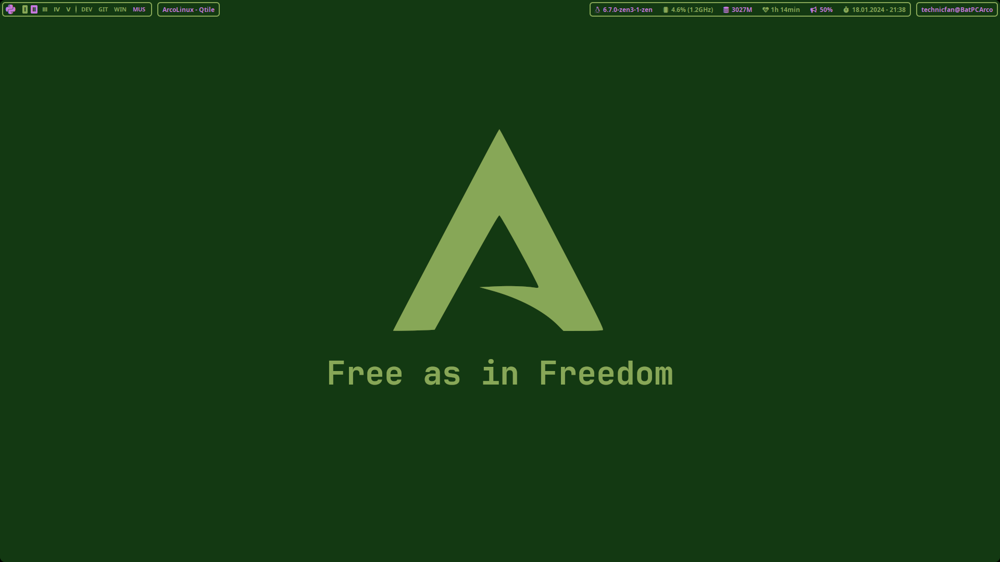
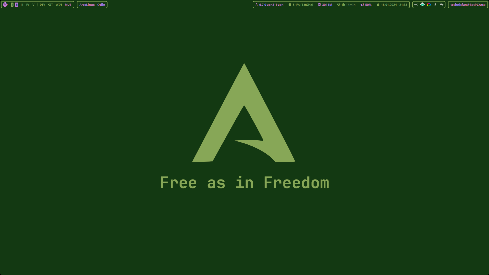
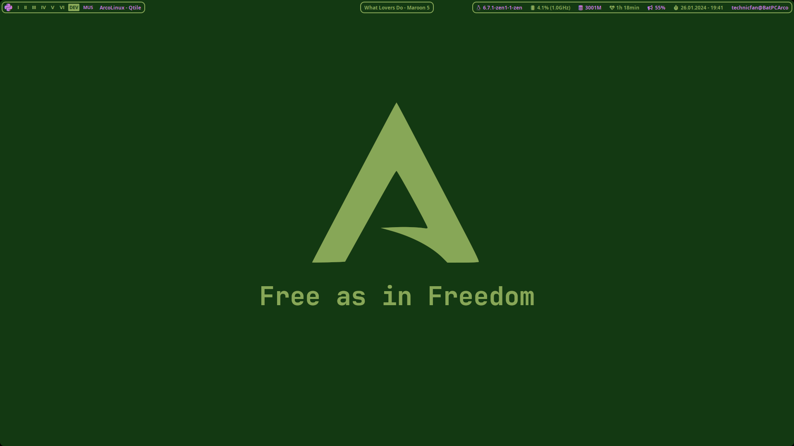
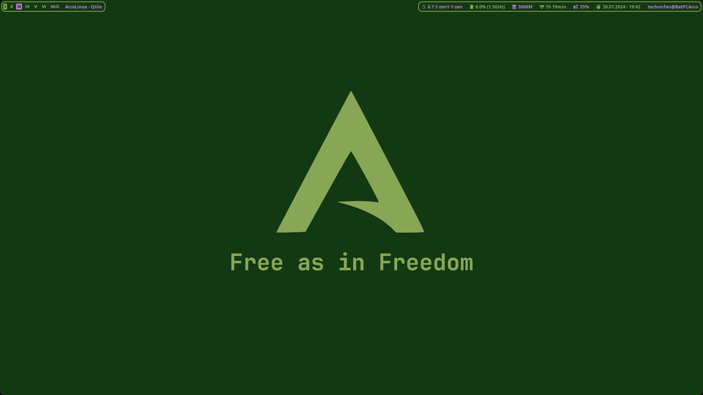

# my-qtile-and-picom-config

personal qtile config originally based on evil DT's config (https://gitlab.com/dwt1/dotfiles/-/tree/master/.config/qtile?ref_type=heads) 

autostart.sh based on the one from ArcoLinux (https://github.com/arcolinux/arcolinux-qtile/blob/master/etc/skel/.config/qtile/scripts/autostart.sh)

qtile and picom folder in .config/

# Screenshots:
normal:

with unhidden systray:

with music player:

second screen:

